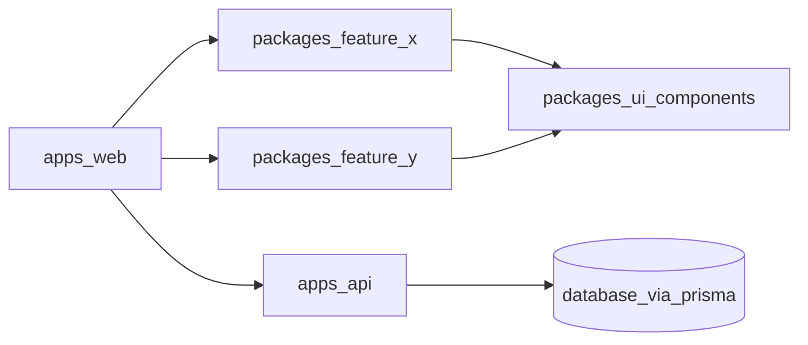

# ASTU Sport Monorepo

Monorepo refactor of the ASTU Sport platform into a teacher-style architecture with shared packages and coordinated app surfaces.

## What this repo now contains

### Apps
- `apps/web` - user + admin frontend (Vite + React)
- `apps/api` - backend API service (Express + Prisma)

### Shared packages
- `packages/ui-components` - reusable UI components and shared layouts
- `packages/utils` - utility helpers
- `packages/feature-x` - feature package
- `packages/feature-y` - feature package (includes extracted auth guards)
- `packages/eslint-config` - shared ESLint config
- `packages/typescript-config` - shared TypeScript configs

## Architecture



## Two integrated systems in one platform

### Admin system
Admin routes (`/admin/*`) manage:
- users and approvals
- tournaments and leagues
- teams and participants
- matches and events
- standings
- injuries
- polls and votes

### User system
User routes (`/user/*`) handle:
- personal dashboard
- fixtures and standings
- polls
- profile
- injury view

### How they work together
Both systems use the same API (`apps/api`) and database. Admin-side updates are immediately visible to user-side pages through shared backend data.

## Monorepo scripts (root)

```bash
npm install
npm run dev        # turbo runs @astu/web + @astu/api
npm run build      # turbo build for web/api
npm run lint       # turbo lint for web/api
npm run typecheck  # turbo typecheck tasks
```

## Environment setup

Copy from `.env.example` and configure values:

- `DATABASE_URL`
- `PORT`
- `JWT_SECRET`
- `CLOUDINARY_CLOUD_NAME`
- `CLOUDINARY_API_KEY`
- `CLOUDINARY_API_SECRET`
- `CORS_ORIGINS`
- `VITE_API_URL`

## API URL migration update

Frontend requests are now centralized through:
- `apps/web/src/config/api.js` (`API_BASE_URL` from `VITE_API_URL`)

No frontend page should hardcode `http://localhost:5000/api` directly anymore.

## Teacher-alignment notes

This refactor aligns to teacher-style monorepo principles:
- app/package separation
- centralized workspace orchestration with Turborepo
- shared lint/typescript config packages
- shared UI/domain packages
- one backend powering role-based frontends

See `docs/teacher-evaluation-walkthrough.md` for presentation/demo framing.
