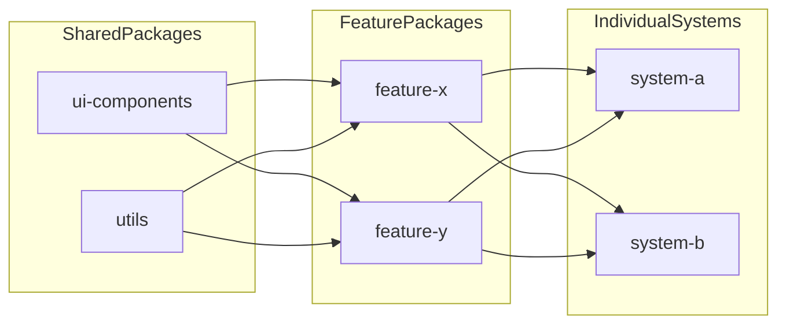

# Architecture

## High-Level Flow

## Package Responsibilities

### Shared

- `ui-components`: visual primitives and reusable composed blocks (`DataCard`, `PrimaryButton`, etc.)
- `utils`: non-UI shared logic (`formatCurrency`, `truncateText`, `isValidEmail`, `apiClient`, etc.)

### Features

- `feature-x`: **Product catalog** — search, category filters, product rows, add-to-cart callbacks
- `feature-y`: **Cart and demo checkout** — line items with quantity controls, subtotal display, shipping form (validation is orchestrated in apps via `apiClient` + `isValidEmail`)

### Systems

- `system-a`: **Shop-first** — large catalog column with cart and checkout alongside
- `system-b`: **Cart-first** — cart and checkout primary; narrow catalog for add-ons

## Data and Composition Notes

- Features own domain models (`Product`, `CartLine`) and expose typed component APIs.
- Apps own **inventory seed data** and **cart state**; they pass props into feature components.
- `formatCurrency` keeps price display consistent; `apiClient` wraps demo checkout attempts with structured success/error results.
