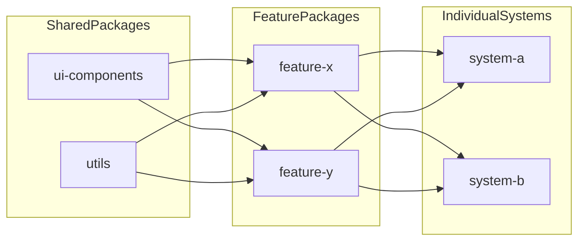

# Architecture

## High-Level Flow

## Package Responsibilities

### Shared
- `ui-components`: visual primitives and reusable composed blocks (`DataCard`, `PrimaryButton`, etc.)
- `utils`: non-UI shared logic (`formatDate`, `truncateText`, `apiClient`, etc.)

### Features
- `feature-x`: Event and schedule workflows
- `feature-y`: Study task workflows

### Systems
- `system-a`: event-first assembly that includes quick task capture
- `system-b`: task-first assembly that includes event context panel

## Data and Composition Notes

- Features own domain models (`CampusEvent`, `StudyTask`) and expose typed component APIs.
- Systems pass configuration/state props into feature components.
- Utility functions centralize formatting and async wrapper behavior.
